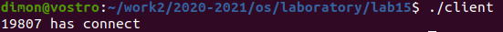
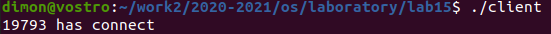

# Отчёт о выполнении лабораторной работы №15
       Именованные каналы


***Российский Университет Дружбы Народов***  
***Факультет Физико-Математических и Естественных Наук***  

 ***Дисциплина:*** *Операционные системы*  
 
 ***Студент:*** *Евсельев Дмитрий*  
 
 ***Группа:*** *НПМ-01-20*  
 
 
## Цель работы 
   >  Приобретение практических навыков работы с именованными каналами

## Задание 

Изучить приведённые в тексте программы server.c и client.c . Взяв данные примеры за образец, напишисать аналогичные программы, внеся следующие изменения:
- Работает не 1 клиент, а несколько (например, два)
- Клиенты передают текущее время с некоторой периодичностью (например, раз в пять секунд). Используйте функцию sleep() для приостановки работы клиента
- Сервер работает не бесконечно, а прекращает работу через некоторое время (например, 30 сек). Используйте функцию clock() для определения времени работы сервера


## Выполнение работы
1. Изменил server.c нижеуказанным образом. Для возможности работы с несколькими клиентами сервер в цикле читает сообщения из канала. Работу прекращает через 30 секунд, независимо оттого получал ли он сообщения. Реализовал с помощью сигналов и системного вызова alarm().

```
#include "common.h"

int readfd; 

void alrm(int s){
    close(readfd);
    unlink(FIFO_NAME);
    printf("server timeout\n");
    exit(0);
}


int main(){
    
    int n;
    char buff[MAX_BUFF]; 
    clock_t now, start;

    signal(SIGALRM, alrm);
    alarm(30);
   
    printf("FIFO Server...\n");
    
    if(mknod(FIFO_NAME, S_IFIFO | 0666, 0) < 0){
        fprintf(stderr, "%s: Невозможно создать FIFO (%s)\n", __FILE__, strerror(errno));
        exit(-1);
    }

    if((readfd = open(FIFO_NAME, O_RDONLY)) < 0){
        fprintf(stderr, "%s: Невозможно открыть FIFO (%s)\n", __FILE__, strerror(errno));
        exit(-2);
    }
 
    while(read(readfd, buff, MAX_BUFF) > 0){
        printf("message from: %s\n", buff);
        if(write(1, buff, n) != n){
            fprintf(stderr, "%s: Ошибка вывода (%s)\n", __FILE__, strerror(errno));
            exit(-3);
        } 
    }
    

close(readfd);

    if(unlink(FIFO_NAME) < 0){
        fprintf(stderr, "%s: Невозможно удалить FIFO (%s)\n", __FILE__, strerror(errno));
        exit(-4);
    }
    exit(0);
} 
````

В заголовочном файле были добавлены библиотеки unistd.h, time.h, signal.h

```
#ifndef __COMMON_H__
#define __COMMON_H__
#include <stdio.h>
#include <stdlib.h>
#include <string.h>
#include <errno.h>
#include <sys/types.h>
#include <sys/stat.h>
#include <fcntl.h>
#include <unistd.h>
#include <time.h> 
#include <signal.h>

#define FIFO_NAME   "/tmp/fifo"
#define MAX_BUFF    80
#endif /* __COMMON_H__ */
```

Клиентская часть выглядит следующим образом:

```
#include "common.h"

int main(){
    int writefd; 
    int msglen;
    char msg[10];
    int pid;

    pid = getpid();
    sprintf(msg,"%d",pid);
    
    if((writefd = open(FIFO_NAME, O_WRONLY)) < 0){
        fprintf(stderr, "%s: Невозможно открыть FIFO (%s)\n", __FILE__, strerror(errno));
        exit(-1);
    }
    printf("%d has connect\n", pid);
    
    msglen = strlen(msg);
    while (write(writefd, msg, msglen) == msglen){
        sleep(5);
    }

    close(writefd);
    exit(0);
}
```
Содержимым сообщения является идентификатор процесса.

2. Проверка работоспособности. Запускаю сервер и 2 клиента.

Рис.1 Сервер


Рис.2. Клиент 1



Рис.3. Клиент 2




3. Что будет в случае, если сервер завершит работу, не закрыв канал?
В моем случае сервер, завершая работу, перед этим закрывает канал во всех случаях.

## Вывод
> Приобрел практические навыкы работы с именованными каналами


## Контрольные вопросы
1. В чем ключевое отличие именованных каналов от неименованных? Именованные каналы отличаются от неименованных наличием идентификатора канала, который представлен как специальный файл (соответственно имя именованного канала — это имя файла). Поскольку файл находится на локальной файловой системе, данное IPC используется внутри одной системы.
2. Возможно ли создание неименованного канала из командной строки? Да, командой pipe.
3. Возможно ли создание именованного канала из командной строки? Да, командой $ mkfifo имя_файла.
4. Опишите функцию языка С, создающую неименованный канал. int read(int pipe_fd, void *area, int cnt); int write(int pipe_fd, void *area, int cnt); Первый аргумент этих вызовов - дескриптор канала, второй - указатель на область памяти, с которой происходит обмен, третий - количество байт. Оба вызова возвращают число переданных байт (или -1 - при ошибке).
5. Опишите функцию языка С, создающую именованный канал. int mkfifo (const char *pathname, mode_t mode); Первый параметр — имя файла, идентифицирующего канал, второй параметр маска прав доступа к файлу. Вызов функции mkfifo() создаёт файл канала (с именем, заданным макросом FIFO_NAME): mkfifo(FIFO_NAME, 0600). 
6. Что будет в случае прочтения из fifo меньшего числа байтов, чем находится в канале? Большего числа байтов? При чтении меньшего числа байтов, чем находится в канале, возвращается требуемое число байтов, остаток сохраняется для последующих чтений. При чтении большего числа байтов, чем находится в канале или FIFO возвращается доступное число байтов. 
7. Аналогично, что будет в случае записи в fifo меньшего числа байтов, чем позволяет буфер? Большего числа байтов? При записи большего числа байтов, чем это позволяет канал или FIFO, вызов write(2) блокируется до освобождения требуемого места. При этом атомарность операции не гарантируется. Если процесс пытается записать данные в канал, не открытый ни одним процессом на чтение, процессу генерируется сигнал. Запись числа байтов, меньшего емкости канала или FIFO, гарантированно атомарно. Это означает, что в случае, когда несколько процессов одновременно записывают в канал, порции данных от этих процессов не перемешиваются. 
8. Могут ли два и более процессов читать или записывать в канал? В общем случае возможна многонаправленная работа процессов с каналом, т.е. возможна ситуация, когда с одним и тем же каналом взаимодействуют два и более процесса, и каждый из взаимодействующих каналов пишет и читает информацию в канал. Но традиционной схемой организации работы с каналом является однонаправленная организация, когда канал связывает два, в большинстве случаев, или несколько взаимодействующих процесса, каждый из которых может либо читать, либо писать в канал.
9. Опишите функцию write (тип возвращаемого значения, аргументы и логику работы). Что означает 1 (единица) в вызове этой функции в программе server.c (строка 42)? Функция записывает length байтов из буфера buffer в файл, определенный дескриптором файла fd. Эта операция чисто 'двоичная' и без буферизации. Реализуется как непосредственный вызов DOS. С помощью функции write мы посылаем сообщение клиенту или серверу.
10. Опишите функцию strerror. Функция, транслирующая код ошибки, который обычно хранится в глобальной переменной errno, в сообщение об ошибке, понятном человеку. Ошибки эти возникают при вызове функций стандартных Си-библиотек. Возвращенный указатель ссылается на статическую строку с ошибкой, которая не должна быть изменена программой. Дальнейшие вызовы функции strerror перезапишут содержание этой строки. Интерпретированные сообщения об ошибках могут различаться, это зависит от платформы икомпилятора.