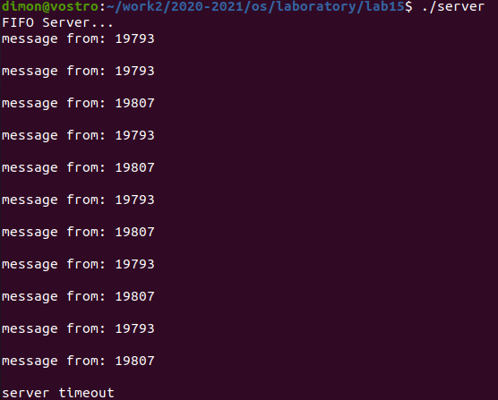

#Презентация по выполнению лабораторной работы №15
       Именованные каналы

***Российский Университет Дружбы Народов***  
***Факультет Физико-Математических и Естественных Наук***  

 ***Дисциплина:*** *Операционные системы*  
 
 ***Студент:*** *Евсельев Дмитрий*    
 
 ***Группа:*** *НПМ-01-20*  
 
 
## Цель работы 
   >Приобретение практических навыков работы с именованными каналами

## Выполнение   

Измененный server.c

```
#include "common.h"

int readfd; 

void alrm(int s){
    close(readfd);
    unlink(FIFO_NAME);
    printf("server timeout\n");
    exit(0);
}


int main(){
    
    int n;
    char buff[MAX_BUFF]; 
    clock_t now, start;

    signal(SIGALRM, alrm);
    alarm(30);
   
    printf("FIFO Server...\n");
    
    if(mknod(FIFO_NAME, S_IFIFO | 0666, 0) < 0){
        fprintf(stderr, "%s: Невозможно создать FIFO (%s)\n", __FILE__, strerror(errno));
        exit(-1);
    }

    if((readfd = open(FIFO_NAME, O_RDONLY)) < 0){
        fprintf(stderr, "%s: Невозможно открыть FIFO (%s)\n", __FILE__, strerror(errno));
        exit(-2);
    }
 
    while(read(readfd, buff, MAX_BUFF) > 0){
        printf("message from: %s\n", buff);
        if(write(1, buff, n) != n){
            fprintf(stderr, "%s: Ошибка вывода (%s)\n", __FILE__, strerror(errno));
            exit(-3);
        } 
    }
    

close(readfd);

    if(unlink(FIFO_NAME) < 0){
        fprintf(stderr, "%s: Невозможно удалить FIFO (%s)\n", __FILE__, strerror(errno));
        exit(-4);
    }
    exit(0);
} 
````


Измененный client.c

```
#include "common.h"

int main(){
    int writefd; 
    int msglen;
    char msg[10];
    int pid;

    pid = getpid();
    sprintf(msg,"%d",pid);
    
    if((writefd = open(FIFO_NAME, O_WRONLY)) < 0){
        fprintf(stderr, "%s: Невозможно открыть FIFO (%s)\n", __FILE__, strerror(errno));
        exit(-1);
    }
    printf("%d has connect\n", pid);
    
    msglen = strlen(msg);
    while (write(writefd, msg, msglen) == msglen){
        sleep(5);
    }

    close(writefd);
    exit(0);
}
```
Измененный common.h
```
#ifndef __COMMON_H__
#define __COMMON_H__
#include <stdio.h>
#include <stdlib.h>
#include <string.h>
#include <errno.h>
#include <sys/types.h>
#include <sys/stat.h>
#include <fcntl.h>
#include <unistd.h>
#include <time.h> 
#include <signal.h>

#define FIFO_NAME   "/tmp/fifo"
#define MAX_BUFF    80
#endif /* __COMMON_H__ */
```

Работа сервера выглядит следующим образом:

Рис.1. Работа сервера


# Вывод
> Приобрел практических навыков работы с именованными каналами